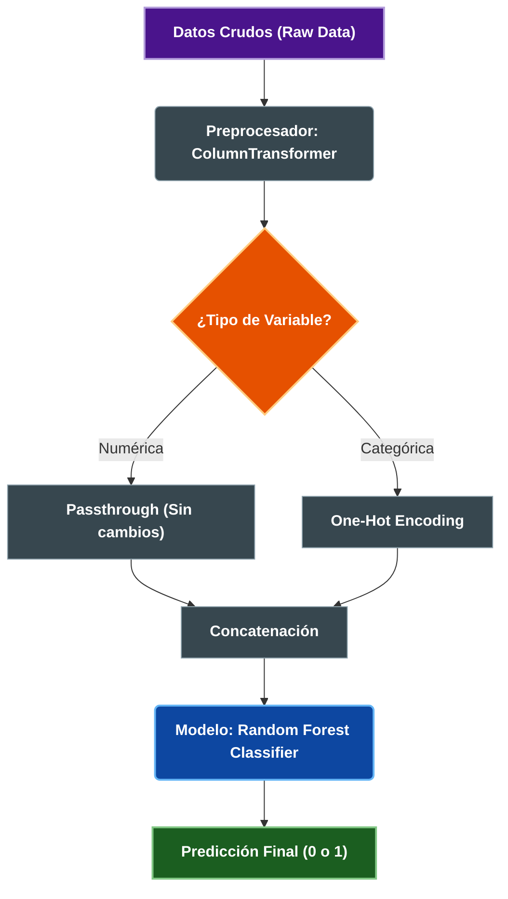

# 📉 Predicción de Churn en Telecomunicaciones


> **Resumen:** Solución End-to-End de Machine Learning para predecir la fuga de clientes (Churn) en una empresa de telecomunicaciones. Incluye limpieza de datos, análisis exploratorio, modelado con Random Forest y un Pipeline automatizado listo para producción.

---

## 📖 Contexto del Proyecto
La pérdida de clientes (Churn) es uno de los desafíos más costosos en la industria de las telecomunicaciones. Este proyecto analiza datos históricos para:
1.  **Entender:** ¿Por qué se van los clientes?
2.  **Predecir:** ¿Qué clientes tienen alta probabilidad de irse el próximo mes?
3.  **Actuar:** Diseñar estrategias de retención basadas en datos.

---

## 📂 Diccionario de Datos
El modelo fue entrenado utilizando un dataset consolidado con las siguientes variables clave:

| Variable | Tipo | Descripción | Ejemplo |
| :--- | :--- | :--- | :--- |
| `customer_id` | Texto | ID único del cliente (No utilizado en predicción) | `7590-VHVEG` |
| `tenure` | Numérico | Meses que el cliente ha permanecido en la empresa | `12`, `24` |
| `monthly_charges` | Numérico | Monto mensual facturado | `29.85` |
| `total_charges` | Numérico | Monto total facturado histórico | `1889.50` |
| `contract_type` | Categórico | Tipo de contrato (Factor crítico) | `Month-to-month`, `Two year` |
| `payment_method` | Categórico | Medio de pago utilizado | `Electronic check`, `Credit card` |
| `internet_service` | Categórico | Tipo de servicio de internet | `Fiber optic`, `DSL`, `No` |
| `churn` | Target | **Variable Objetivo:** ¿El cliente canceló? | `0` (No), `1` (Sí) |

---

## 🛠️ Tecnologías y Herramientas
* **Lenguaje:** Python
* **ETL & Análisis:** Pandas, NumPy
* **Visualización:** Seaborn, Matplotlib
* **Machine Learning:** Scikit-Learn (Random Forest, Pipeline, ColumnTransformer)
* **Control de Versiones:** Git/GitHub

---

## ⚙️ Arquitectura del Proyecto

El desarrollo se estructuró en 4 fases principales:

1.  **Ingeniería de Datos (ETL):** Limpieza de nulos, tratamiento de duplicados y transformación de tipos.
2.  **EDA (Análisis Exploratorio):** Detección de patrones y correlaciones.
3.  **Modelado:** Entrenamiento y validación de algoritmos.
4.  **Deployment:** Creación de un Pipeline serializado.

### 🔄 Flujo del Pipeline (Model Workflow)
El siguiente diagrama ilustra cómo el artefacto `.joblib` procesa los datos automáticamente:


## 📊 Resultados e Insights de Negocio

El modelo **Random Forest** alcanzó un **Accuracy aproximado del 90%** en el set de prueba. Basado en la importancia de las variables (Feature Importance), se generaron las siguientes recomendaciones:

1.  **Alerta en Contratos Mensuales:** Los clientes con contrato "Month-to-month" son los más propensos a irse.
    * *Estrategia:* Ofrecer descuentos por migración a planes anuales.
2.  **Riesgo en Nuevos Clientes:** La tasa de cancelación es crítica en los primeros meses (`tenure` bajo).
    * *Estrategia:* Programa de "Onboarding VIP" durante los primeros 90 días.
3.  **Sensibilidad al Precio:** Usuarios con cargos altos sin servicios premium tienden a rotar.
    * *Estrategia:* Revisión de planes y oferta de beneficios exclusivos.

---

## 🚀 Cómo usar este proyecto

### 1. Clonar el repositorio
```bash
git clone [https://github.com/](https://github.com/)[TU-USUARIO]/[NOMBRE-REPO].git

### 2. Cargar el Modelo (Para integración en Backend)
El proyecto entrega un archivo `pipeline_churn_v1.joblib` que acepta datos crudos.

```python
import joblib
import pandas as pd

# Cargar el pipeline
modelo = joblib.load('models/pipeline_churn_v1.joblib')

# Ejemplo de cliente nuevo (Datos crudos como vienen de la web)
nuevo_cliente = pd.DataFrame([{
    'contract_type': 'Month-to-month',
    'monthly_charges': 70.5,
    'tenure': 2,
    'payment_method': 'Electronic check',
    # ... otras columnas requeridas
}])

# Predicción (0 = Se queda, 1 = Se va)
prediccion = modelo.predict(nuevo_cliente)
print(f"Predicción de Churn: {prediccion[0]}")
```

## 📂 Estructura de Archivos
```text
├── data/                # Dataset utilizado
├── notebooks/           # Notebook con el análisis completo (.ipynb)
├── models/              # Archivos .joblib listos para producción
├── README.md            # Documentación del proyecto
└── requirements.txt     # Librerías necesarias
```
---

## ✒️ Autor
**Daisy Quinteros Silva**
* **Rol:** Data Scientist / Ingeniero en Informática
* [LinkedIn](www.linkedin.com/in/daisy-quinteros-silva-5b0450a5)


---
*Proyecto realizado como parte del programa ONE (Oracle Next Education) - Alura Latam.*
